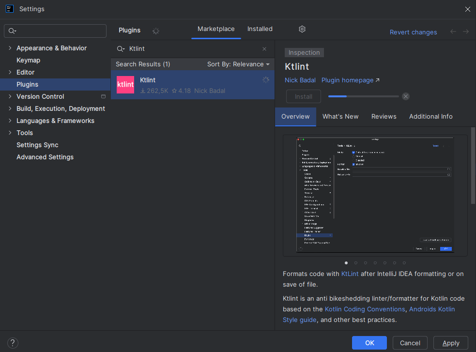

# Instalacion de Detekt o Ktlint

Instalaremos el programa Ktlint:

- Nos vamos a la rueda de ajustes

- Y le damos a Plugins.

- Buscamos Ktlint y le damos a instalar.

- Una vez instalado tendremos que reiniciar el ID.
